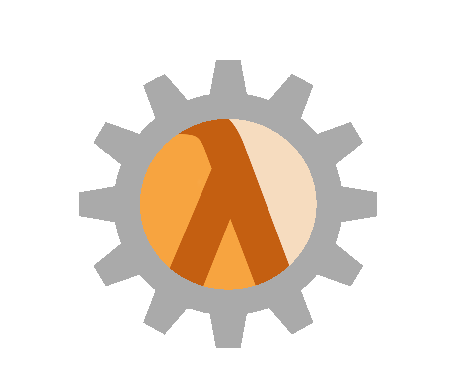
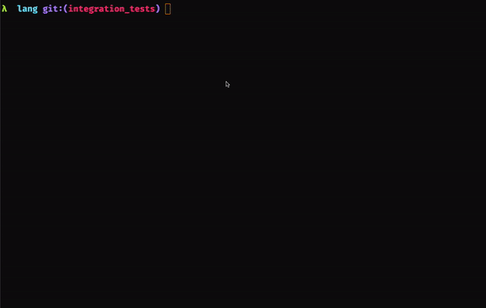

# Steel
<div align="center">
    
</div>

<div align="center">

An embeddable and extensible scheme dialect built in Rust.

 
[](https://coveralls.io/github/mattwparas/steel?branch=master)

<a href="https://mattwparas.github.io/steel-playground/dev">
    <b>Try it on the Playground</b>
</a>


</div>

## Getting Started

This github repository contains a client that uses the `steel`, `steel_derive`, and `steel_repl` crates (which also live in this repo). To try it out on the online playground, go to the [Steel playground](https://mattwparas.github.io/steel-playground/dev). To get started using a repl with the crates, make sure you first have rust installed.

Then, clone the repo and run the following command:

```bash
cargo run
```

This will launch a REPL instance that looks something like this:

<p align="center">
  
</p>

## About

`Steel` is an embedded scheme interpreter. Inspired largely by Racket and Clojure, the language seeks to be ergonomic scheme variant helpful for embedding in applications, or to be used on its own with high performance functions implemented in Rust. The language implementation itself contains a fairly powerful macro system based on the `syntax-rules` style and a bytecode virtual machine.

## Features

* Limited `syntax-rules` style macros are supported
* Easy integration with Rust functions and structs
* Easily call a script from rust or via a separate file
* Few dependencies
* Efficient - common functions and data structures are optimized for performance (`map`, `filter`, etc)
* Higher order Contracts
* Built in immutable data structures include:
  * lists
  * vectors
  * hashmaps
  * hashsets

## Contracts

Inspired by Racket's higher order contracts, `Steel` implements\* higher order contracts to enable design by contract, made easy with a `define/contract` macro for easier ergonomics. Racket makes use of a concept known as _blame_ which seeks to identify the violating party - `Steel` does not quite have fully fleshed out blame but that is a work in progress. Here are some examples:

```scheme
;; Simple flat contracts
(define/contract (test x y)
    (->/c even? even? odd?)
    (+ x y 1))

(test 2 2) ;; => 5

(define/contract (test-violation x y)
    (->/c even? even? odd?)
    (+ x y 1))

(test-violation 1 2) ;; contract violation

```

Contracts are implemented as _values_, so they are bound to functions. This enables the use of contract checking on functions themselves since functions can be passed around:

```scheme
;; Higher order contracts, check on application
(define/contract (higher-order func y)
    (->/c (->/c even? odd?) even? even?)
    (+ 1 (func y)))

(higher-order (lambda (x) (+ x 1)) 2) ;; => 4

(define/contract (higher-order-violation func y)
    (->/c (->/c even? odd?) even? even?)
    (+ 1 (func y)))

(higher-order-violation (lambda (x) (+ x 2)) 2) ;; contract violation
```

Contracts on functions do not get checked until they are applied, so a function returning a _contracted_ function won't cause a violation until that function is actually used:

```scheme
;; More higher order contracts, get checked on application
(define/contract (output)
    (->/c (->/c string? int?))
    (lambda (x) 10))

(define/contract (accept func)
    (->/c (->/c string? int?) string?)
    "cool cool cool")

(accept (output)) ;; => "cool cool cool"

;; different contracts on the argument
(define/contract (accept-violation func)
    (->/c (->/c string? string?) string?)
    (func "applesauce")
    "cool cool cool")

(accept-violation (output)) ;; contract violation

;; generates a function
(define/contract (generate-closure)
    (->/c (->/c string? int?))
    (lambda (x) 10))

;; calls generate-closure which should result in a contract violation
(define/contract (accept-violation)
    (->/c (->/c string? string?))
    (generate-closure))

((accept-violation) "test") ;; contract violation
```

Perhaps a more nuanced case:

```scheme
(define/contract (output)
    (->/c (->/c string? int?))
    (lambda (x) 10.2))

(define/contract (accept)
    (->/c (->/c string? number?))
    (output))


((accept) "test") ;; contract violation 10.2 satisfies number? but _not_ int?
```

\* Very much a work in progress

## Transducers

Inspired by clojure's transducers, `Steel` has a similar object that is somewhere half way in between transducers and iterators. Consider the following:

```scheme

(mapping (lambda (x) (+ x 1))) ;; => <#iterator>
(filtering even?) ;; => <#iterator>
(taking 15) ;; => <#iterator>

(compose 
    (mapping add1)
    (filtering odd?)
    (taking 15)) ;; => <#iterator>
```

Each of these expressions emit an `<#iterator>` object, which means they're compatible with `execute` and `transduce`. Execute takes a transducer (i.e. `<#iterator>`) and a collection that can be iterated (`list`, `vector`, or `stream`) and applies the transducer.

```scheme
;; Accepts lists
(execute (mapping (lambda (x) (+ x 1))) (list 1 2 3 4 5)) ;; => '(2 3 4 5 6)

;; Accepts vectors
(execute (mapping (lambda (x) (+ x 1))) (vector 1 2 3 4 5)) ;; '#(2 3 4 5 6)

;; Even accepts streams!
(define (integers n)
    (stream-cons n (lambda () (integers (+ 1 n)))))

(execute (taking 5) (integers 0)) ;; => '(0 1 2 3 4)
```

Transduce is just `reduce` with more bells and whistles and works similarly:

```scheme
;; (-> transducer reducing-function initial-value iterable)
(transduce (mapping (lambda (x) (+ x 1))) + 0 (list 0 1 2 3)) ;; => 10
```

Compose just combines the iterator functions and lets us avoid intermediate allocation. The composition works left to right - it chains each value through the functions and then accumulates into the output type. See the following:

```scheme
(define xf 
    (compose 
        (mapping add1)
        (filtering odd?)
        (taking 5)))

(execute xf (range 0 100)) ;; => '(1 3 5 7 9)
```

By default, execute outputs to the same type that was passed in. In other words, if you `execute` a `list`, it will return a `list`. However, if you so choose, you can pass in a symbol specifying the output type of your choosing like so:

```scheme
(define xf 
    (compose 
        (mapping add1)
        (filtering odd?)
        (taking 5)))

;; Takes a list and returns a vector
(execute xf (range 0 100) 'vector) ;; => '#(1 3 5 7 9)

;; Takes a vector and returns a list
(execute xf (vector 0 1 2 3 4 5 6 7 8 9 10) 'list) ;; => '(1 3 5 7 9)
```

## Syntax Choices

`Steel` is mildly opinionated in that there a few ways to define variables and functions. These choices are fairly arbitrary except for the shorthand function syntax, which I borrowed from Racket. `defn` and `fn` were really encouraged by me wanting to type less characters.

```scheme

;; All of the following are equivalent
(define (foo x) (+ x 1))
(define foo (lambda (x) (+ x 1)))
(defn (foo x) (+ x 1))
(defn foo (lambda (x) (+ x 1)))

;; All of the following are equivalent
(lambda (x) (+ x 1))
(λ (x) (+ x 1))
(fn (x) (+ x 1))
```

## Modules

In order to support a growing codebase, Steel has module support for projects spanning multiple files. Steel files can `provide` values (with contracts attached) and `require` modules from other files:

```scheme
;; main.stl
(require "provide.stl")

(even->odd 10)


;; provide.stl
(provide 
    (contract/out even->odd (->/c even? odd?))
    no-contract
    flat-value)

(define (even->odd x) 
    (+ x 1))

(define (accept-number x) (+ x 10))

(define (no-contract) "cool cool cool")
(define flat-value 15)

(displayln "Calling even->odd with some bad inputs but its okay")
(displayln (even->odd 1))
```

Here we can see if we were to run `main` that it would include the contents of `provide`, and only provided values would be accessible from `main`. The contract is attached at the contract boundary, so inside the `provide` module, you can violate the contract, but outside the module the contract will be applied.

A few notes on modules:
* Cyclical dependencies are not allowed
* Modules will be only compiled once and used across multiple files. If `A` requires `B` and `C`, and `B` requires `C`, `C` will be compiled once and shared between `A` and `B`. 
* Modules will be recompiled when changed, and any dependent files will also be recompiled as necessary

## Performance

Preliminary benchmarks show the following on my machine:

| Benchmark | Steel | Python |
|-----------|-------|--------|
| (fib 28) | 82.46ms | 65.10 ms|
| (ack 3 3) | 0.88 ms | 0.195 ms|

## Examples of embedding Rust values in the virtual machine

Rust values, types, and functions are easily embedded into Steel. Using the `register_fn` call, you can embed functions easily:

```rust
use steel_vm::engine::Engine;
use steel_vm::register_fn::RegisterFn;

fn external_function(arg1: usize, arg2: usize) -> usize {
    arg1 + arg2
}

fn option_function(arg1: Option<String>) -> Option<String> {
    arg1
}

fn result_function(arg1: Option<String>) -> Result<String, String> {
    if let Some(inner) = arg1 {
        Ok(inner)
    } else {
        Err("Got a none".to_string())
    }
}

pub fn main() {
    let mut vm = Engine::new();

    // Here we can register functions
    // Any function can accept parameters that implement `FromSteelVal` and
    // return values that implement `IntoSteelVal`
    vm.register_fn("external-function", external_function);

    // See the docs for more information about `FromSteelVal` and `IntoSteelVal`
    // but we can see even functions that accept/return Option<T> or Result<T,E>
    // can be registered
    vm.register_fn("option-function", option_function);

    // Result values will map directly to errors in the VM and bubble back up
    vm.register_fn("result-function", result_function);

    vm.run(
        r#"
        (define foo (external-function 10 25))
        (define bar (option-function "applesauce"))
        (define baz (result-function "bananas"))
    "#,
    )
    .unwrap();

    let foo = vm.extract::<usize>("foo").unwrap();
    println!("foo: {}", foo);
    assert_eq!(35, foo);

    // Can also extract a value by specifying the type on the variable
    let bar: String = vm.extract("bar").unwrap();
    println!("bar: {}", bar);
    assert_eq!("applesauce".to_string(), bar);

    let baz: String = vm.extract("baz").unwrap();
    println!("baz: {}", baz);
    assert_eq!("bananas".to_string(), baz);
}
```

We can also embed structs themselves:

```rust
use steel_vm::engine::Engine;
use steel_vm::register_fn::RegisterFn;

use steel_derive::Steel;

// In order to register a type with Steel,
// it must implement Clone, Debug, and Steel
#[derive(Clone, Debug, Steel, PartialEq)]
pub struct ExternalStruct {
    foo: usize,
    bar: String,
    baz: f64,
}

impl ExternalStruct {
    pub fn new(foo: usize, bar: String, baz: f64) -> Self {
        ExternalStruct { foo, bar, baz }
    }

    // Embedding functions that take self must take by value
    pub fn method_by_value(self) -> usize {
        self.foo
    }

    // Setters should update the value and return a new instance (functional set)
    pub fn set_foo(mut self, foo: usize) -> Self {
        self.foo = foo;
        self
    }
}

pub fn main() {
    let mut vm = Engine::new();

    // Registering a type gives access to a predicate for the type
    vm.register_type::<ExternalStruct>("ExternalStruct?");

    // Structs in steel typically have a constructor that is the name of the struct
    vm.register_fn("ExternalStruct", ExternalStruct::new);

    // register_fn can be chained
    vm.register_fn("method-by-value", ExternalStruct::method_by_value)
        .register_fn("set-foo", ExternalStruct::set_foo);

    let external_struct = ExternalStruct::new(1, "foo".to_string(), 12.4);

    // Registering an external value is fallible if the conversion fails for some reason
    // For instance, registering an Err(T) is fallible. However, most implementation outside of manual
    // ones should not fail
    vm.register_external_value("external-struct", external_struct)
        .unwrap();

    let output = vm
        .run(
            r#"
            (define new-external-struct (set-foo external-struct 100))
            (define get-output (method-by-value external-struct))
            (define second-new-external-struct (ExternalStruct 50 "bananas" 72.6))
            "last-result"
        "#,
        )
        .unwrap();

    let new_external_struct = vm.extract::<ExternalStruct>("new-external-struct").unwrap();
    println!("new_external_struct: {:?}", new_external_struct);
    assert_eq!(
        ExternalStruct::new(100, "foo".to_string(), 12.4),
        new_external_struct
    );

    // Can also extract a value by specifying the type on the variable
    let get_output: usize = vm.extract("get-output").unwrap();
    println!("get_output: {}", get_output);
    assert_eq!(1, get_output);

    let second_new_external_struct: ExternalStruct =
        vm.extract("second-new-external-struct").unwrap();
    println!(
        "second_new_external_struct: {:?}",
        second_new_external_struct
    );
    assert_eq!(
        ExternalStruct::new(50, "bananas".to_string(), 72.6),
        second_new_external_struct
    );

    // We also get the output of the VM as the value of every expression run
    // we can inspect the results just by printing like so
    println!("{:?}", output);
}
```

See the examples folder for more examples on embedding values and interacting with the outside world.


## License

Licensed under either of

 * Apache License, Version 2.0
   ([LICENSE-APACHE](LICENSE-APACHE) or http://www.apache.org/licenses/LICENSE-2.0)
 * MIT license
   ([LICENSE-MIT](LICENSE-MIT) or http://opensource.org/licenses/MIT)

at your option.

## Contribution

Unless you explicitly state otherwise, any contribution intentionally submitted
for inclusion in the work by you, as defined in the Apache-2.0 license, shall be
dual licensed as above, without any additional terms or conditions.
